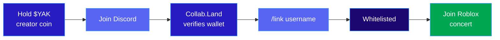

# bloxparty

**Token-Gated Concerts on Roblox, Powered by Audius**

Hold the coin. Join the show.

[](https://bloxparty.up.railway.app)
[](https://solana.com)
[](https://audius.co)
[](https://typescriptlang.org)

[**Live Demo**](https://bloxparty.up.railway.app) · [**Discord**](https://discord.gg/sDawtbUm) · [**Roadmap**](ROADMAP.md)

---

## What is Bloxparty?

Artists launch creator coins on Audius. Fans who hold the coin unlock exclusive concert experiences in Roblox. The full pipeline — from on-chain token to in-game access — runs through one platform.



### Why?

- Virtual concerts are proven — Lil Nas X drew **33M attendees** on Roblox
- Roblox has **80M+ DAU**, mostly Gen Z/Alpha
- Artists have creator coins on Audius but **no way to gate real experiences** with them
- Token-gating exists on Discord but **never reaches the game**

Bloxparty bridges all three: **Audius** (the ticket) → **Discord** (the gate) → **Roblox** (the venue).

---

## Architecture

```mermaid
flowchart TB
    subgraph WEB["Next.js Web App"]
        LP[Landing Page]
        AD[Artist Discovery]
        AP[Artist Profiles]
        MP[Music Player]
        EV[Events]
    end

    subgraph AUDIUS["Audius API"]
        CO[Coins + Prices]
        US[Users + Tracks]
        ST[Audio Stream]
    end

    subgraph DISCORD["Discord"]
        CL[Collab.Land]
        BOT[/link /status /unlink]
    end

    subgraph ROBLOX["Roblox"]
        VER[Verifier.lua]
        AUD[AudioManager.lua]
    end

    PG[(PostgreSQL)]

    WEB <--> AUDIUS
    BOT -->|"whitelist API"| PG
    VER -->|"verify API"| PG
    CL -->|"role"| BOT
    WEB --> PG

    style WEB fill:#0a0a0a,stroke:#261CC1,color:#ededed
    style AUDIUS fill:#7E1BCC,stroke:#B15EFF,color:#fff
    style DISCORD fill:#5865F2,stroke:#7289DA,color:#fff
    style ROBLOX fill:#00A651,stroke:#00D166,color:#fff
```

---

## Features

| | Feature | Details |
|-|---------|---------|
| **Coins** | Creator Coin Ticker | Live prices, market cap, 24h volume, holder count |
| **Artists** | Discovery + Profiles | Sort by MC/volume/votes, Birdeye charts, track playback |
| **Music** | Streaming Player | 8 genres, search, seek, volume, auto-advance |
| **Events** | Creation + Detail | Quick Fill from trending artists, playlist auto-fetch |
| **Gate** | Token-Gating Pipeline | Collab.Land → Discord role → Roblox whitelist |
| **Bot** | Discord Commands | `/link`, `/status`, `/unlink` with username auto-lookup |
| **Roblox** | In-Game Verification | Whitelist check on join + concert audio playback |
| **Wallet** | Phantom Integration | Auto-detect Audius identity from Solana wallet |

---

## Audius Integration — 14 Endpoints

```
Coins       /coins  /coins/:mint  /coins/:mint/members  /coins/:mint/insights
Users       /users/:id  /users/:id/tracks  /users/:id/supporters
            /users/:id/connected_wallets  /users/search  /users/id?associated_wallet=X
Tracks      /tracks/trending  /tracks/search  /tracks/:id/stream
Playlists   /playlists/:id/tracks
```

---

## Demo: Kodak Black $YAK

| | |
|-|-|
| **Artist** | [@kodakblack](https://audius.co/kodakblack) on Audius |
| **Coin** | $YAK — `ZDaUDL4XFdEct7UgeztrFQAptsvh4ZdhyZDZ1RpxYAK` |
| **Flow** | Hold $YAK → `kodakBLOX` Discord role → Roblox whitelist |

---

## Quick Start

```bash
git clone https://github.com/hamzaskewl/bloxparty.git && cd bloxparty
npm install
cd discord && npm install && cd ..
cp .env.example .env   # edit with your credentials
npm run dev             # web app on :3000
cd discord && node bot.js  # bot in separate terminal
```

### Deploy on Railway

| Service | Root Dir | Start |
|---------|----------|-------|
| Web App | `/` | `npm start` |
| Discord Bot | `/discord` | Dockerfile |

---

## Project Structure

```
src/app/
  page.tsx                    Landing — ticker, featured artists, Roblox CTA
  artists/page.tsx            Discovery — sort, vote, search
  artists/[id]/page.tsx       Profile — chart, tracks, coin stats
  events/page.tsx             Create — Quick Fill, track preview
  events/[id]/page.tsx        Detail — playlist, coin card, links
  music/page.tsx              Player — genres, streaming
  api/roblox/whitelist/       POST/DELETE whitelist
  api/roblox/verify/          GET verification
  api/artists/vote/           POST/GET votes

src/lib/audius/client.ts      14 Audius API endpoints
src/lib/db/schema.ts          events, roblox_whitelist, artist_votes

discord/bot.js                /link, /status, /unlink
roblox/Verifier.lua           Whitelist check on join
roblox/AudioManager.lua       Concert playlist playback
```

---

## Tech Stack

**Frontend** — Next.js 15, React 19, TypeScript, Tailwind v4, glassmorphism
**Blockchain** — Solana Web3.js, Phantom, Audius API, Collab.Land
**Backend** — Drizzle ORM, PostgreSQL, Next.js API Routes
**Discord** — discord.js v14, slash commands, Roblox username lookup
**Roblox** — Lua, HttpService, Sound playback
**Infra** — Railway, Docker

---

<p align="center">
  
  <br /><br />
  <strong>Hold the coin. Join the show.</strong>
  <br />
  Built for Solana's Graveyard Hack — Audius Music Bounty
</p>